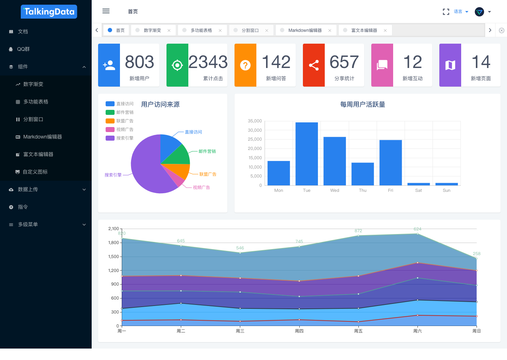

## 简介
[cyb-iview-admin](http://www.hestudy.com/cyb/cyb-iview-admin/)是基于Vue.js，搭配使用[iView](https://www.iviewui.com) UI组件库形成的一套后台集成解决方案，用于演示塞伯坦（Cybertron）- CYB强大的工程构建能力。

<div align="center">
  
</div>

## 功能

- 登录/登出
- 权限管理
    - 列表过滤
    - 权限切换
- 多语言切换
- 组件
    - 富文本编辑器
    - Markdown编辑器
    - 城市级联
    - 图片预览编辑
    - 可拖拽列表
    - 文件上传
    - 数字渐变
    - split-pane
- 表单编辑
    - 文章发布
    - 工作流
- 表格
    - 可拖拽排序
    - 可编辑表格
        - 行内编辑
        - 单元格编辑
    - 可搜索表格
    - 表格导出数据
        - 导出为Csv文件
        - 导出为Xls文件
    - 表格转图片
- 错误页面
    - 403页面
    - 404页面
    - 500页面
- 高级路由
    - 动态路由
    - 带参页面
- 换肤
- 收缩侧边栏
- tag标签导航
- 面包屑导航
- 全屏/退出全屏
- 锁屏
- 消息中心
- 个人中心


## 开发

```
# 全局安装CYB

npm install -g cyb-cli
```

```bash
# 克隆项目

git clone https://github.com/jd-cyb/cyb-iview-admin.git

# 安装依赖

cd cyb-iview-admin
npm install

# 启动服务

cyb dev
```

> cyb会帮助我们自动打开浏览器进入研发环境。

## 发布
```bash
# 发布

cyb dist

# 本地测试

cyb test
```

## 示例

[查看示例](http://www.hestudy.com/cyb/cyb-iview-admin/)

## License
[MIT](http://opensource.org/licenses/MIT)

Copyright (c) 2018, 京东商城-基础平台研发部-[CYB前端小组](https://github.com/jd-cyb)
